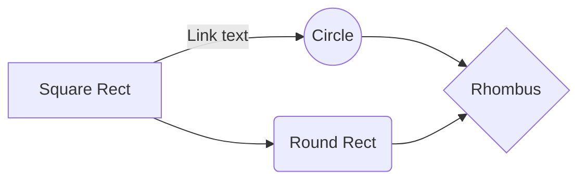
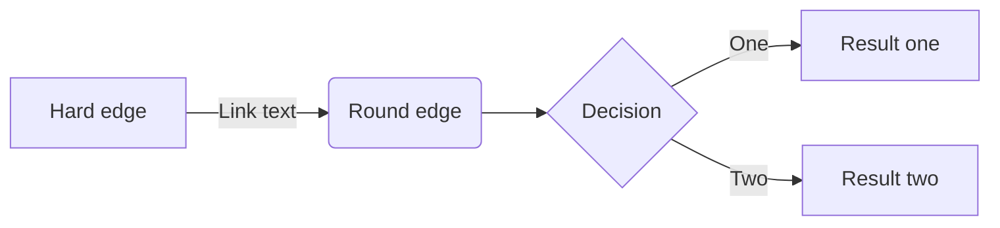

{width=100px height=100px}

# Titolo Progetto d'Esame
Legame tra SPORT e SOCIETÀ 

## Introduzione

Il progetto ha avuto come obiettivo la creazione di un compendio digitale dedicato alla storia dello sport nel Novecento, e su come abbia impattato su certi aspetti culturali, sociali e politici. A partire da documenti testuali strutturati, è stato sviluppato un flusso editoriale automatizzato per produrre contenuti in formato HTML, PDF e EPUB.

I contenuti sono stati realizzati in HTML e CSS per garantire una presentazione coerente, mentre JavaScript (integrato nei file .html) è stato utilizzato per l’estrazione automatica dei metadati da Wikipedia, senza uso di linguaggi lato server. La conversione nei diversi formati è avvenuta tramite Pandoc, con il supporto di file di metadati strutturati secondo standard come Dublin Core e Schema.org.

Il flusso di produzione è stato rappresentato con un diagramma BPMN che descrive in modo chiaro le fasi: raccolta, verifica, impaginazione, esportazione e pubblicazione. Il risultato è un prodotto editoriale accessibile, ben organizzato e ricco di contenuti multimediali, capace di raccontare eventi sportivi significativi e il loro impatto nella società. 

## Ideazione 

### Tema
Il tema centrale di questo progetto editoriale è l’evoluzione dello sport nel corso del Novecento, analizzato non solo come attività agonistica, ma come fenomeno sociale, culturale e politico. Il prodotto nasce con l’intento di raccontare eventi sportivi emblematici che hanno avuto un impatto profondo sulla società, mettendo in luce come lo sport abbia spesso rappresentato uno specchio del contesto storico in cui si è sviluppato.

Al centro del lavoro vi sono momenti e figure simboliche: Jesse Owens alle Olimpiadi di Berlino del 1936, Diego Armando Maradona con la celebre “Mano de Dios” ai Mondiali del 1986, e Michael Jordan con la sua visione dello sport come disciplina e resilienza. Attraverso questi casi, si affrontano temi trasversali come il razzismo, la propaganda politica, la rivincita sociale, il mito sportivo e la comunicazione globale.

Il progetto risponde all’esigenza di raccontare lo sport in chiave documentale, fornendo fonti, testimonianze e materiali strutturati, e colma un bisogno informativo spesso trascurato: quello di legare lo sport alla memoria collettiva e alla storia culturale. Le domande più frequenti che guidano il progetto sono: in che modo lo sport ha influito sui cambiamenti sociali? Quali eventi sportivi hanno avuto un impatto oltre il campo di gioco? Come si può raccontare lo sport come patrimonio documentale?

Attraverso un impianto narrativo chiaro e formati digitali accessibili (HTML, EPUB, PDF), il progetto si propone di rispondere a questi interrogativi, offrendo contenuti documentati, navigabili e destinati sia al pubblico generico che al contesto educativo e culturale.

### Destinatari
Per identificare il pubblico di riferimento del compendio digitale “La Storia nello Sport”, sono state individuate tre personas, che rappresentano in modo sintetico i principali tipi di utenti a cui il prodotto è destinato. Ognuna riflette bisogni, interessi e modalità diverse di fruizione.

Personas 1:
Una prima figura a cui il prodotto si rivolge è quella di uno studente universitario, ad esempio Luca, 22 anni, iscritto a Scienze motorie. Luca è appassionato di sport, ma anche curioso di comprendere il legame tra eventi sportivi e dinamiche storiche e sociali. Per lui, un compendio ben organizzato, con fonti attendibili e disponibili in formati digitali versatili, rappresenta uno strumento utile per le ricerche, le tesine e lo studio. Luca può leggere i contenuti dal computer, dal tablet o su un lettore EPUB, prendere appunti, inserire citazioni e approfondire eventi come le Olimpiadi del 1936 con uno sguardo critico e documentato.

Personas 2: 
Un secondo scenario coinvolge Giulia, 40 anni, insegnante di storia e educazione civica in una scuola secondaria di secondo grado. Giulia cerca strumenti innovativi e coinvolgenti per trattare in classe tematiche sociali attuali attraverso esempi storici. Grazie al compendio, può mostrare agli studenti pagine in HTML, proiettare immagini, leggere brani di interviste o visualizzare video, utilizzando lo sport come chiave per affrontare questioni come l’inclusione, la discriminazione, la propaganda o l’identità culturale. Il compendio diventa così uno strumento didattico trasversale, utile per stimolare riflessioni e dibattiti in aula.

Personas 3: 
Infine, il progetto si rivolge anche a lettori adulti e appassionati di storia dello sport, come Marco, 65 anni, un ex bibliotecario in pensione con una forte passione per le biografie sportive e i racconti legati alla memoria collettiva. Marco predilige la lettura su dispositivi e-reader, e apprezza contenuti curati, ricchi di contesto, ma anche accessibili e gradevoli nella forma. Il compendio, nella sua versione EPUB, gli permette di ripercorrere episodi come la “Mano de Dios” o le imprese di Michael Jordan, non solo come episodi sportivi, ma come momenti che hanno segnato l’immaginario collettivo di intere generazioni.

Attraverso queste figure immaginarie ma rappresentative, il prodotto si dimostra in grado di soddisfare esigenze differenti: supporto allo studio, strumento didattico, lettura culturale e memoria storica. La struttura digitale e multiformato consente una fruizione ampia, inclusiva e trasversale, adattandosi alle modalità e ai tempi di ogni utente.

### Modello di fruizione
Il prodotto editoriale deve essere accessibile, navigabile e fruibile da dispositivi diversi, mantenendo coerenza tra HTML, PDF ed EPUB. Il modello di lettura adottato è tematico e modulare, adatto sia alla consultazione scolastica che alla lettura personale. I contenuti devono essere chiari, ben organizzati e corredati da immagini e fonti affidabili. Si fa riferimento agli standard EPUB 3.0, HTML5, Dublin Core e Schema.org per garantire compatibilità e archiviazione. L’innovazione risiede nell’uso di JavaScript per l’aggiornamento automatico dei metadati da Wikipedia e nella conversione multiformato con Pandoc. La qualità è garantita da un equilibrio tra contenuto informativo e impatto culturale.

### Canali di distribuzione
Il prodotto editoriale sarà distribuito attraverso più canali per garantire ampia accessibilità e adattabilità ai diversi contesti d’uso. Il canale principale sarà il Web, tramite una versione HTML navigabile pubblicabile su siti personali, piattaforme didattiche o repository culturali. In parallelo, sarà prodotta una versione EPUB 3.0 per la lettura su e-reader e dispositivi mobili, utile per studenti e appassionati. La versione PDF sarà pensata per la stampa o la consultazione offline, con impaginazione curata e aderenza agli standard tipografici tradizionali.

Per i social media, saranno previsti estratti testuali o visivi (immagini, frasi iconiche, brevi video), collegati al contenuto principale. È ipotizzabile anche una distribuzione in ambito didattico o istituzionale tramite Intranet scolastiche o accademiche.

L’identità visiva seguirà uno stile colorato e vivace, titoli in maiuscolo e colori contrastanti fra loro per garantirne la visibilità. Verranno evitate soluzioni grafiche troppo complesse per garantire leggibilità. Il tono sarà prevalentemente formale, ma accessibile, con l’obiettivo di mantenere un equilibrio tra rigore informativo e coinvolgimento del lettore. Si intende così trasmettere una sensazione di affidabilità e cura editoriale, aderendo ai modelli classici della divulgazione culturale ma proponendo al tempo stesso un’esperienza di fruizione aggiornata e multiformato.

## Processo di Produzione

### Acquisizione dei contenuti
I contenuti del prodotto editoriale sono stati acquisiti principalmente da fonti libere e accessibili, in particolare Wikipedia, utilizzata tramite la sua API ufficiale REST. Questa scelta ha permesso di integrare automaticamente metadati aggiornati, descrizioni sintetiche e immagini senza costi di licenza. L’uso di API pubbliche ha ridotto i tempi di redazione, garantendo al contempo l’affidabilità e la verificabilità delle informazioni.

Oltre ai dati estratti automaticamente, alcune sezioni sono state inserite manualmente per contestualizzare gli eventi storici o per sviluppare introduzioni e riflessioni tematiche. Le immagini e i video inclusi nel progetto provengono da fonti con licenza libera (es. Wikimedia Commons o YouTube).

### Gestione documentale
Il flusso di gestione documentale del progetto è stato strutturato in modo chiaro e sequenziale, per garantire coerenza e tracciabilità in ogni fase della produzione editoriale. La prima fase ha riguardato la raccolta e produzione dei contenuti, avvenuta sia attraverso l’acquisizione automatica di dati da fonti aperte (come Wikipedia, tramite API REST), sia mediante la redazione manuale di introduzioni, descrizioni e approfondimenti. Questa combinazione ha permesso di coniugare accuratezza e originalità, mantenendo basso il costo di produzione.

Successivamente è stata effettuata una valutazione dei diritti, selezionando esclusivamente materiali testuali e visivi disponibili con licenza libera (es. CC BY-SA), per assicurare una piena libertà di distribuzione nei diversi formati. I contenuti raccolti sono stati poi strutturati tematicamente, suddivisi in file HTML indipendenti ma coerenti tra loro, organizzati secondo logiche cronologiche o per argomento.

La fase di applicazione dello stile grafico ha previsto l’utilizzo di un foglio di stile CSS unico, per garantire uniformità visiva e tipografica in tutte le versioni del prodotto. L’impaginazione è stata progettata per essere chiara, accessibile e coerente con il tono divulgativo del progetto.

Successivamente si è proceduto alla generazione e gestione dei metadati, utilizzando schemi standard (Dublin Core, Schema.org e ONIX), sia in forma dichiarativa (YAML) sia tramite estrazione dinamica. Questa fase è stata fondamentale per garantire la futura archiviazione e interoperabilità dei contenuti. I contenuti sono stati poi trasformati automaticamente in formato PDF ed EPUB tramite Pandoc, consentendo una diffusione multiformato senza dover duplicare il lavoro redazionale.

Infine, la fase di distribuzione ha incluso la pubblicazione su web e la preparazione di file scaricabili (PDF/EPUB), con la possibilità di diffondere estratti sui social. Ogni fase del processo è stata accompagnata da momenti di revisione e controllo, sia dei testi che della resa grafica, per assicurare la qualità e la coerenza complessiva del prodotto editoriale.

### Tecnologie adottate

Descrivere le tecnologie addottate nelle diverse fasi e discuterne il contributo in termini di raggiungimento degli obiettivi descritti negli scenari d'uso.

|                |Scenario 1                          |Scenario 2                       |
|----------------|-------------------------------|-----------------------------|
|Markdown |`'Isn't this fun?'`            |'Isn't this fun?'            |
|XSLT       |`"Isn't this fun?"`            |"Isn't this fun?"            |
|ePud         |`-- is en-dash, --- is em-dash`|-- is en-dash, --- is em-dash|

### Esecuzione del flusso
Allegare, possibilmente attraverso il riferimento ad un repository documentale, i materiali, gli script, le configurazioni, che permettono di riprodurre il flusso di produzione documentale. I contenuti non devono necessariamente essere completi, può essere sufficiente fornire un prototipo per ogni tipologia di contenuto previsto e per ogni formato di destinazione previsto.  

## Valutazione dei risultati raggiunti

### Valutazione del flusso di produzione

Per valutare il contributo proposto valutare le diverse fasi del flusso in termini di (i) riduzione dei tempi di gestione documentale, (ii) riduzione degli errori, (iii) miglioramento della qualità dei documenti, (iv) miglioramento del livello di accettazione della tecnologia, (v) raggiungimento di nuovi canali di distribuzione, (vi) soddisfacimento di nuovi scenari d'uso.
 
### Confronto con lo stato dell'arte

Può anche essere utile confrontare una versione ASIS del flusso di gestione, senza la tecnologia o le innovazioni proposte, e una TOBE che include la tecnologia e le innovazioni proposte dallo studente.

### Limiti emersi

È importante sottolineare i limiti emersi. Come l'impossibilità di accesso ad alcune tecnologie o fasi del flusso di gestione documentale, limiti nella automazione di alcune passi di trasformazione dei formati o di integrazione delle sorgenti

## Conclusioni

Discutere i risultati ottenuti, verificando se gli obiettivi definiti dai casi d'uso siano pienamente o parzialmente raggiunti. Evidenziare gli aspetti nei quali si sono raggiunti i risultati più soddisfacenti e le limitazioni emerse.

## Bibliografia e sitografia

Elencare i riferimenti bibliografici e risorse online che hanno maggiormente contribuito alla realizzazione del progetto. Ad esempio [@sechi2010,@pantieri2021,@ceravolo2023]
